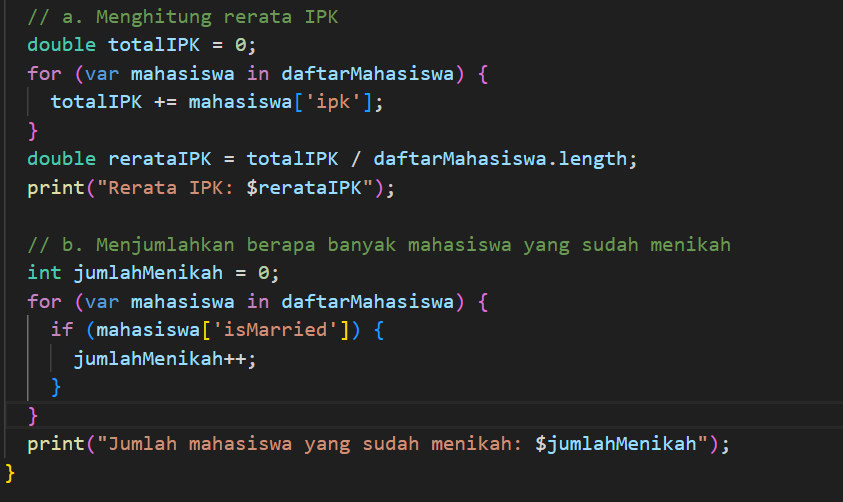
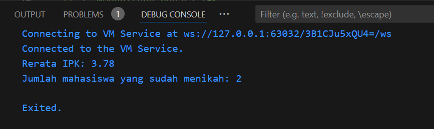

# PERTEMUAN 2

## SOAL :

void main() {
List<Map<String, dynamic>> daftarMahasiswa = [
{
"nama": "John Doe",
"ipk": 3.88,
"isMarried": false,
},
{
"nama": "Andi Doe",
"ipk": 3.78,
"isMarried": true,
},
{
"nama": "Budi Doe",
"ipk": 3.68,
"isMarried": true,
}
];
}

1. Buatkan algoritma :
a. Menghitung rerata dari IPK 
b. Menjumlahkan berapa banyak mahasiswa yang sudah nikah 
2. Masing-masing dari poin 1.a dan 1.b diimplementasikan dalam kode program

### JAWABAN 
1.  a. input
    
    b. output
    
